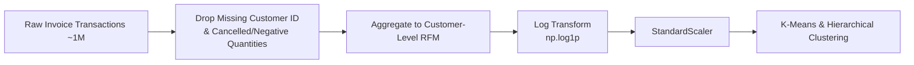
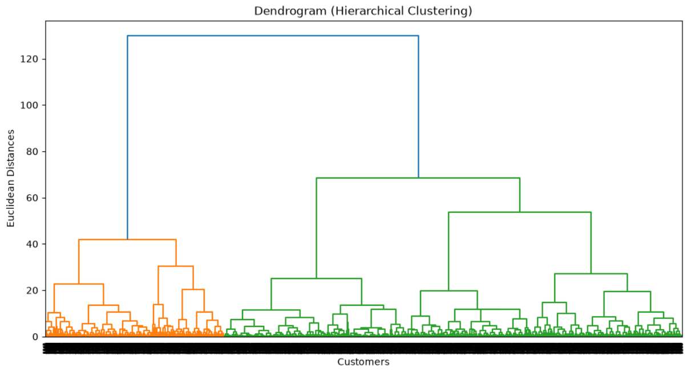
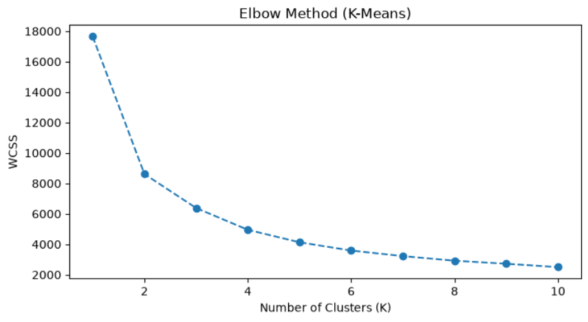
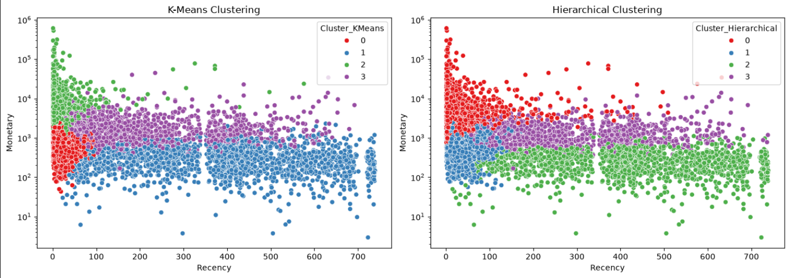

<div align="center">

#  Customer Segmentation using K-Means & Hierarchical Clustering

### Turning ~1M retail transactions into actionable customer personas via RFM analysis


*An end-to-end unsupervised learning pipeline comparing centroid-based and connectivity-based clustering to segment customers into business-ready marketing personas.*

[Overview](#-executive-summary--problem-overview) • [Dataset](#-dataset-information) • [Feature Engineering](#-data-preprocessing--feature-engineering) • [Cluster Selection](#-optimal-cluster-selection-k--4) • [Model Comparison](#-model-evaluation--comparison) • [Business Personas](#-business-persona-mapping--strategy)

</div>

---

##  Executive Summary & Problem Overview

Effective marketing requires understanding **distinct customer behaviors**, not treating every shopper as interchangeable. Raw transactional data, however, is recorded at the individual-purchase level — it cannot be fed directly into a clustering algorithm without first being aggregated into a customer-level profile.

This project engineers **RFM (Recency, Frequency, Monetary)** features at the customer level from ~1 million raw invoice transactions, normalizes them via log transformation and standardization, and then compares two fundamentally different clustering paradigms — **centroid-based (K-Means)** and **connectivity-based (Agglomerative Hierarchical)** — to build customer segments that translate directly into marketing strategy.

**What this project demonstrates:**

| Capability | Implementation |
|---|---|
| Transaction-to-customer aggregation | RFM feature engineering from ~1M raw invoice rows |
| Skew correction | Log transformation (`np.log1p`) on heavily right-skewed monetary/frequency data |
| Feature scaling | `StandardScaler` for fair distance-based comparison |
| Optimal cluster count selection | Dendrogram analysis + Elbow Method, cross-validated against each other |
| Algorithm comparison | K-Means vs. Hierarchical, evaluated on Silhouette Score and Davies-Bouldin Index |
| Business translation | Cluster output mapped to concrete, actionable marketing personas |

---

##  Dataset Information

**Source:** [Online Retail II Dataset — Kaggle](https://www.kaggle.com/datasets/mashlyn/online-retail-ii-uci)

**Scale:** ~1,000,000 raw invoice transactions, aggregated into unique customer-level RFM profiles.

### RFM Feature Definitions

| Feature | Definition |
|---|---|
| **Recency (R)** | Days since the customer's last completed transaction |
| **Frequency (F)** | Count of distinct completed purchases |
| **Monetary (M)** | Total revenue generated by the customer |

> RFM was chosen as the feature basis because it distills complex purchase histories into three behaviorally intuitive, business-interpretable dimensions — which matters as much for stakeholder buy-in as it does for the clustering math itself.

---

##  Data Preprocessing & Feature Engineering



### 1 · Cleaning
Dropped rows missing `Customer ID` and removed cancelled/negative-quantity transactions (`Quantity > 0`), ensuring the RFM calculation reflects only genuine, completed purchases.

### 2 · Aggregation
Computed line-item spend (`Quantity × Price`), then aggregated Recency, Frequency, and Monetary metrics grouped by `Customer ID` — collapsing the ~1M-row transaction log into one row per customer.

### 3 · Log Transformation
Applied `np.log1p()` to Monetary and Frequency, both of which were heavily right-skewed — a small number of extremely high-spending or high-frequency customers would otherwise dominate the distance calculations that both clustering algorithms rely on, distorting the resulting segments toward outliers rather than representative behavior patterns.

### 4 · Feature Scaling
Applied `StandardScaler` to place Recency, Frequency, and Monetary on comparable scales. This step is essential for both algorithms: K-Means and Hierarchical Clustering are both distance-based, so a feature with a naturally larger numeric range (e.g., Monetary in dollars vs. Frequency as a single-digit count) would otherwise silently dominate the clustering result.

---

##  Optimal Cluster Selection (K = 4)

Rather than picking a cluster count arbitrarily, two independent methods were used to **cross-validate** the choice of K.

### 1 · Hierarchical Dendrogram Analysis

Using `ward` linkage and Euclidean distance, the dendrogram's largest vertical gaps — where cutting the tree separates clusters most cleanly — visually confirm **4 distinct natural groupings**.

<p align="center">
  
</p>

### 2 · K-Means Elbow Method

The Within-Cluster Sum of Squares (WCSS) plot shows a clear inflection point — the "elbow" — at **K = 4**, beyond which additional clusters yield diminishing reductions in within-cluster variance.

<p align="center">
  
</p>

**Both methods independently converge on K = 4** — meaningful agreement, since they arrive at the same answer from entirely different mathematical approaches (linkage distances vs. variance minimization).

---

##  Model Evaluation & Comparison

Both algorithms were fitted on the same scaled RFM feature set and evaluated using internal cluster validation metrics (no ground-truth labels exist for this unsupervised problem, so external accuracy metrics don't apply):

| Clustering Algorithm | Silhouette Score ↑ | Davies-Bouldin Index ↓ | Evaluation |
|---|:---:|:---:|---|
| **K-Means Clustering** | **0.3663** | 0.9355 | Slightly higher separation and cluster cohesion |
| **Hierarchical Clustering** | 0.3314 | **0.9317** | Comparable performance, marginally better DB index |

**How to read these metrics:**
- **Silhouette Score** (range −1 to 1, higher is better) measures how well-separated and internally cohesive clusters are — K-Means' higher score suggests slightly tighter, more distinct groupings.
- **Davies-Bouldin Index** (lower is better) measures average similarity between each cluster and its most similar neighbor — Hierarchical's marginally lower score suggests slightly less cluster overlap.

The two algorithms perform **comparably overall**, with each winning on a different metric — a common and expected outcome when comparing centroid-based vs. connectivity-based clustering on the same data. K-Means was ultimately used for the final business segmentation due to its stronger Silhouette Score and significantly better scalability to larger customer bases.

### Visual Cluster Comparison

Side-by-side scatter plots of customer distribution across the Recency–Monetary plane, for direct visual comparison of how each algorithm partitions the customer base:

<p align="center">
  
</p>

---

##  Business Persona Mapping & Strategy

The four data-driven clusters were mapped to actionable marketing personas, combining each segment's RFM profile with a concrete recommended strategy:

| Segment | Avg. Recency | Avg. Frequency | Avg. Monetary | Recommended Strategy |
|---|:---:|:---:|:---:|---|
|  **Champions / VIP** | Low (< 30 days) | High (> 15 orders) | High (> $10,000) | Exclusive VIP rewards, early access to new collections, dedicated account support |
|  **Loyal Regulars** | Moderate (30–90 days) | High (> 10 orders) | Moderate–High | Cross-selling recommendations, loyalty points to maximize Customer Lifetime Value (CLV) |
|  **Recent / New Buyers** | Low Recency, low order count | Low | Low–Moderate | Welcome discount codes, onboarding email sequences, popular product suggestions |
|  **At-Risk / Lost Customers** | High–Very High (> 120–250+ days) | Low (1–2 orders) | Low–Moderate | Targeted win-back campaigns, re-engagement promotions, low-cost automated email sequences |

This is the core deliverable of the project: each cluster isn't just a statistical grouping, but a segment a marketing team can act on directly — with a distinct campaign, message, and investment level per group, rather than a single blanket strategy applied to the entire customer base.

---

##  Technologies Used

| Category | Tools |
|---|---|
| Language | Python |
| Data Handling | Pandas, NumPy |
| Machine Learning | Scikit-learn (K-Means, Agglomerative Clustering) |
| Visualization | Matplotlib, Seaborn, SciPy (dendrogram) |

---

##  Project Structure

```
Customer-Segmentation-RFM-Clustering/
│
├── images/
│   ├── dendrogram.png
│   ├── elbow_method.png
│   └── cluster_comparison.png
├── data/
│   └── online_retail_ii.csv
├── notebooks/
│   └── customer_segmentation_rfm.ipynb
├── README.md
└── requirements.txt
```

---

##  Installation

```bash
# 1. Clone the repository
git clone https://github.com/khaled-amireh/Customer-Segmentation-RFM-Clustering.git
cd Customer-Segmentation-RFM-Clustering

# 2. Create and activate a virtual environment (recommended)
python -m venv venv
source venv/bin/activate      # On Windows: venv\Scripts\activate

# 3. Install dependencies
pip install -r requirements.txt

# 4. Launch the notebook
jupyter notebook notebooks/customer_segmentation_rfm.ipynb
```

---

##  Limitations

- As with all unsupervised clustering, there is no ground-truth label to validate segment "correctness" against — evaluation relies on internal metrics (Silhouette, Davies-Bouldin) and business interpretability rather than predictive accuracy.
- RFM features alone don't capture product-category preferences or channel behavior, which could refine segments further.
- Cluster boundaries are based on a static snapshot of transaction history; customer behavior — and therefore segment membership — will drift over time, so periodic re-clustering would be needed in production.

---

##  Future Improvements

- [ ] Incorporate product-category and channel-level features alongside RFM for richer segmentation
- [ ] Evaluate DBSCAN or Gaussian Mixture Models as additional clustering approaches
- [ ] Build a recurring re-clustering pipeline to track segment drift over time
- [ ] A/B test the recommended marketing strategies per segment to validate real-world impact
- [ ] Add a customer lifetime value (CLV) prediction layer on top of segment assignment

---

## 👤 Author

**Khaled Amireh**
[GitHub](https://github.com/khaled-amireh)

---

<div align="center">

*If you found this project useful, consider giving it a ⭐ on GitHub.*

</div>
